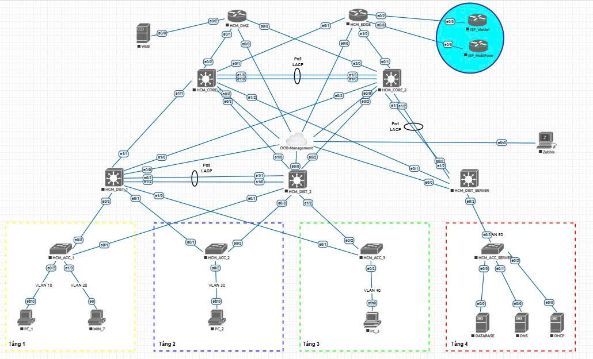

# Hệ thống Tự động hóa & Giám sát Mạng Doanh nghiệp (Enterprise Network Automation & Monitoring)

## Tổng quan Dự án (Project Overview)
Dự án này trình bày giải pháp thiết kế, triển khai và vận hành kiến trúc mạng doanh nghiệp có tính sẵn sàng cao (High Availability) ứng dụng phương pháp luận NetDevOps. Được xây dựng dựa trên mô hình mạng phân cấp 3 lớp chuẩn mực (Core, Distribution, Đa truy nhập) kết hợp với mặt phẳng quản trị ngoại băng (Out-of-Band Management) độc lập, hệ thống đảm bảo loại bỏ hoàn toàn điểm nghẽn vật lý và logic (Zero Single Point of Failure) thông qua cơ chế đấu chéo (Dual-homed) tại cụm Server Farm và DMZ. 

Dự án tích hợp mã nguồn tự động hóa bằng Python để cấp phát cấu hình hàng loạt (Mass Provisioning) và triển khai nền tảng giám sát tập trung để thu thập dữ liệu viễn thông (Telemetry) theo thời gian thực.

## Kiến trúc & Công nghệ áp dụng
* **Mô hình Mạng (Topology):** Hệ thống lai (Hybrid) giữa Mạng Doanh nghiệp (Campus) và Trung tâm Dữ liệu (Data Center), mô phỏng trên EVE-NG.
* **Bộ điều khiển Tự động hóa (Automation Controller):** Máy chủ Ubuntu Linux thực thi các kịch bản Python (thư viện Netmiko) để cấp phát cấu hình tự động. Thông tin xác thực hệ thống được đồng bộ (`admin`/`admin`).
* **Hệ thống Giám sát (Monitoring Stack):** Máy chủ Zabbix thu thập dữ liệu SNMP, tích hợp an toàn qua mạng lưới OOB bị cô lập hoàn toàn với dữ liệu người dùng.
* **Mặt phẳng Điều khiển (Control Plane):** OSPF Area 0 (Định tuyến đường trục Backbone), eBGP (Định tuyến biên/Peering với ISP), HSRP (Giao thức dự phòng Gateway Lớp 3).
* **Mặt phẳng Dữ liệu (Data Plane):** Giao thức gộp cổng chuẩn mở LACP (802.3ad) EtherChannel, giao thức chống vòng lặp Rapid-PVST+, và khung bảo mật L2 chuyên sâu (DHCP Snooping, DAI, Port Security).

## Sơ đồ Kiến trúc Mạng (Network Diagrams)

### 1. Kiến trúc Vật lý (Physical Topology)
*Sơ đồ bố trí mặt bằng không gian cáp vật lý tại các tủ rack trung tâm (MDF) và tủ phân phối cáp điện nhẹ các tầng (IDF).*

### 2. Kiến trúc Logic (Logical Topology)
*Sơ đồ định tuyến, mặt phẳng luồng giao thông dữ liệu, quy hoạch Vlan và mạng quản trị OOB.*

## Bảng Quy hoạch IP & Định tuyến (IP Addressing & Routing Plan)

| STT | Tên Thiết Bị | Cổng Giao Tiếp | Địa Chỉ IP | Định Tuyến (Đích đến) | Định Tuyến (Gateway/Nexthop) | Ghi Chú |
| :--- | :--- | :--- | :--- | :--- | :--- | :--- |
| **1** | **ISP_Viettel** | e0/0 | 203.162.1.1/30 | 10.28.0.0/16 | 203.162.1.2 | eBGP Peering |
| **2** | **ISP_Mobi** | e0/0 | 222.252.1.1/30 | 10.28.0.0/16 | 222.252.1.2 | eBGP Peering |
| **3** | **HCM_EDGE** | e0/2 | 203.162.1.2/30 | 0.0.0.0/0 (Default) | 203.162.1.1 | Viettel (Primary Link) |
| | | e0/3 | 222.252.1.2/30 | 0.0.0.0/0 (Default) | 222.252.1.1 | MobiFone (Backup Link) |
| | | e0/1 | 10.28.1.1/30 | 10.28.0.0/16 | Học qua OSPF | Kết nối HCM_CORE_1 |
| | | e0/0 | 10.28.1.5/30 | | Học qua OSPF | Kết nối HCM_CORE_2 |
| | | mgmt0 | 10.28.99.254/24 | | | IP Quản trị OOB |
| **4** | **HCM_CORE_1** | e0/1 | 10.28.1.2/30 | 0.0.0.0/0 (Default) | 10.28.1.1 (EDGE) | OSPF Area 0 |
| | | Po2 | 10.28.1.9/30 | | | LACP Inter-link HCM_CORE_2 |
| | | e1/1 | 10.28.1.13/30 | | | Kết nối HCM_DIST_1 |
| | | e1/3 | 10.28.1.17/30 | | | Kết nối HCM_DIST_2 |
| | | e0/2 | 10.28.1.29/30 | | | Kết nối HCM_DMZ |
| | | e1/2 | 10.28.1.37/30 | | | Kết nối HCM_DIST_SRV |
| | | mgmt0 | 10.28.99.11/24 | | | IP Quản trị OOB |
| **5** | **HCM_CORE_2** | e0/1 | 10.28.1.6/30 | 0.0.0.0/0 (Default) | 10.28.1.5 (EDGE) | OSPF Area 0 |
| | | Po2 | 10.28.1.10/30 | | | LACP Inter-link HCM_CORE_1 |
| | | e0/3 | 10.28.1.21/30 | | | Kết nối HCM_DIST_1 |
| | | e0/2 | 10.28.1.25/30 | | | Kết nối HCM_DIST_2 |
| | | e2/0 | 10.28.1.33/30 | | | Kết nối HCM_DMZ |
| | | Po1 | 10.28.1.41/30 | | | Kết nối HCM_DIST_SRV |
| | | mgmt0 | 10.28.99.12/24 | | | IP Quản trị OOB |
| **6** | **HCM_DIST_1** | Vlan 10 | 10.28.10.252/24 | 0.0.0.0/0 | Học qua OSPF | HSRP Active Gateway: .254 |
| | | Vlan 20 | 10.28.20.252/24 | | | HSRP Active Gateway: .254 |
| | | mgmt0 | 10.28.99.21/24 | | | IP Quản trị OOB |
| **7** | **HCM_DIST_2** | Vlan 30 | 10.28.30.253/24 | 0.0.0.0/0 | Học qua OSPF | HSRP Active Gateway: .254 |
| | | Vlan 40 | 10.28.40.253/24 | | | HSRP Active Gateway: .254 |
| | | mgmt0 | 10.28.99.22/24 | | | IP Quản trị OOB |
| **8** | **HCM_DMZ** | Vlan 100| 10.28.100.254/24| 0.0.0.0/0 | Học qua OSPF | Public Web Gateway |
| | | mgmt0 | 10.28.99.26/24 | | | IP Quản trị OOB |
| **9** | **HCM_DIST_SRV**| Vlan 50 | 10.28.50.254/24 | 0.0.0.0/0 | Học qua OSPF | Internal SRV Gateway |
| | | mgmt0 | 10.28.99.25/24 | | | IP Quản trị OOB |
| **10**| **WEB Server** | eth0 | 10.28.100.10/24 | 0.0.0.0/0 | 10.28.100.254 | Dịch vụ Public (DMZ Zone) |
| **11**| **Database** | eth0 | 10.28.50.10/24 | 0.0.0.0/0 | 10.28.50.254 | Dịch vụ Nội bộ (Internal) |
| **12**| **DNS** | eth0 | 10.28.50.11/24 | 0.0.0.0/0 | 10.28.50.254 | Dịch vụ Nội bộ (Internal) |
| **13**| **DHCP** | eth0 | 10.28.50.12/24 | 0.0.0.0/0 | 10.28.50.254 | Cấp phát IP linh động |
| **14**| **Zabbix** | eth0 | 10.28.99.101/24 | N/A | N/A | Giao tiếp mạng quản trị OOB |

## Tính năng Cốt lõi (Key Features)
* **Tự động hóa Cấp phát (Automated Provisioning):** Đẩy đồng loạt các cấu hình phức tạp (Vlan, STP, Định tuyến, LACP) xuống nhiều thiết bị mạng một cách có hệ thống thông qua thư viện Netmiko.
* **Định tuyến & Chuyển mạch Dự phòng (Resilient Routing & Switching):** Tích hợp toàn diện OSPF Multi-area mang lại khả năng hội tụ tính bằng mili-giây (sub-second failover), được hỗ trợ bởi các kênh truyền LACP EtherChannel nhằm tối đa hóa băng thông và vô hiệu hóa các cổng bị chặn bởi STP.
* **Quản trị Ngoại băng Cách ly (Isolated OOB Management):** Sở hữu một mặt phẳng quản trị vật lý/logic hoàn toàn độc lập, đảm bảo quyền truy cập đặc quyền của quản trị viên ngay cả khi mặt phẳng dữ liệu (Data Plane) gặp sự cố gián đoạn nghiêm trọng.
* **Thu thập Dữ liệu Viễn thông (Real-time Telemetry):** Theo dõi liên tục các chỉ số sinh tồn của thiết bị (Tải CPU, RAM, băng thông cổng giao tiếp) thông qua giao thức SNMP về máy chủ Zabbix trung tâm.

## Hướng dẫn Triển khai (Getting Started)
Để tái tạo lại môi trường dự án này:
1. Import file sơ đồ logic `.unl` được đính kèm vào hệ thống EVE-NG của bạn.
2. Thiết lập chế độ Bridge cho đám mây `OOB-Management` liên kết trực tiếp với card mạng VMnet trên VMware.
3. Khởi động Máy chủ Ubuntu Automation và cài đặt môi trường ảo: `pip install netmiko`.
4. Thực thi tuần tự các kịch bản cấp phát cấu hình tại thư mục `/scripts`.
